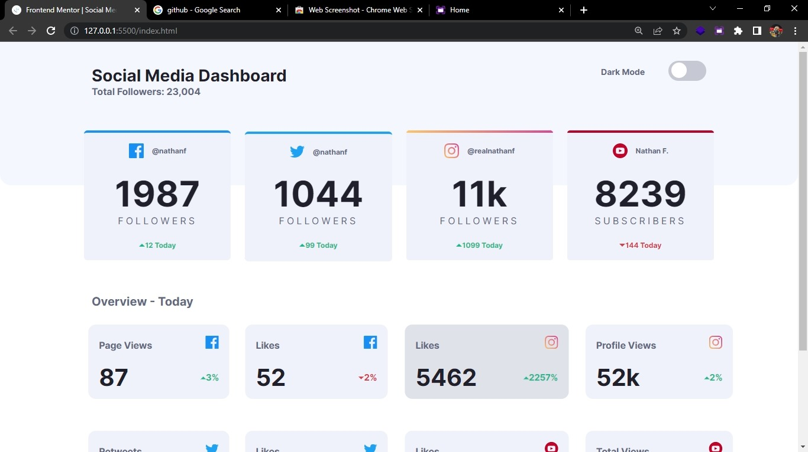

# Frontend Mentor - Social media dashboard with theme switcher solution

This is a solution to the [Social media dashboard with theme switcher challenge on Frontend Mentor](https://www.frontendmentor.io/challenges/social-media-dashboard-with-theme-switcher-6oY8ozp_H). Frontend Mentor challenges help you improve your coding skills by building realistic projects. 

## Table of contents

- [Overview](#overview)
  - [The challenge](#the-challenge)
  - [Screenshot](#screenshot)
  - [Links](#links)
- [My process](#my-process)
  - [Built with](#built-with)
- [Author](#author)
- [Acknowledgments](#acknowledgments)

## Overview

### The challenge

Users should be able to:

- View the optimal layout for the site depending on their device's screen size
- See hover states for all interactive elements on the page
- Toggle color theme to their preference

### Screenshot

### Links

- Solution URL: [Solution URL](https://github.com/mishael-codes/social-media-dashboard-with-theme-switcher-master)
- Live Site URL: [Live site URL](https://mishael-codes.github.io/social-media-dashboard-with-theme-switcher-master/)

## My process

### Built with

- Semantic HTML5 markup
- CSS properties
- Flexbox
- CSS Grid
- Mobile-first workflow

## Author

- Twitter - [@mishael_codes](https://www.twitter.com/mishael_codes)
- Instagram - [@mishael.codes](https://www.instagram.com/mishael.codes)
- Frontend Mentor - [@mishael-codes](https://www.frontendmentor.io/profile/mishael-codes)

